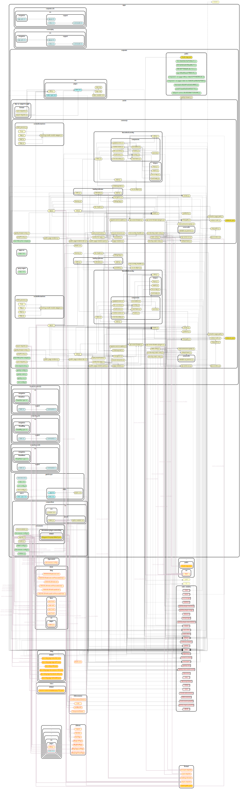

# Waweb

This project was generated using [Nx](https://nx.dev).

🔎 **Smart, Extensible Build Framework**

## Source Graph

\*\* note: use the "messiness" of the source graph as a general indicator of when to refactor out & specialize reusable components.

